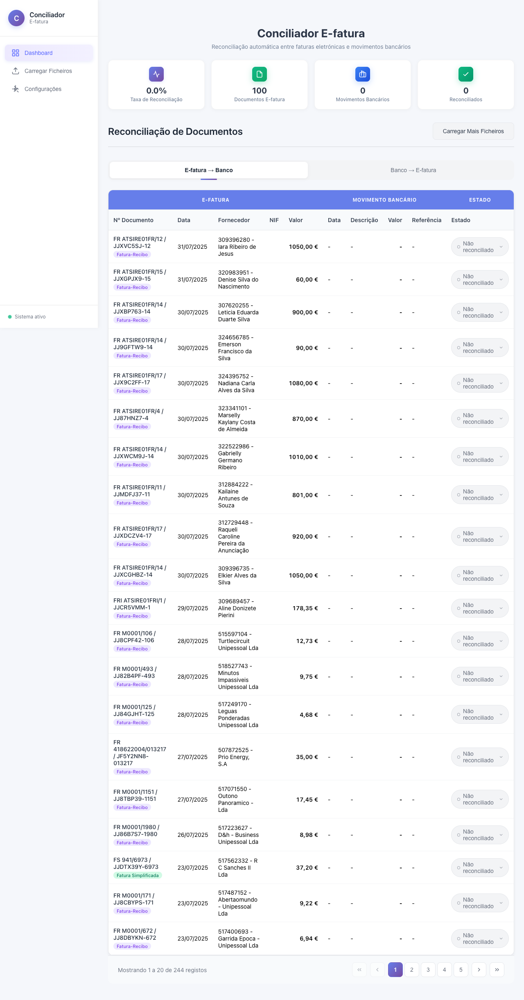
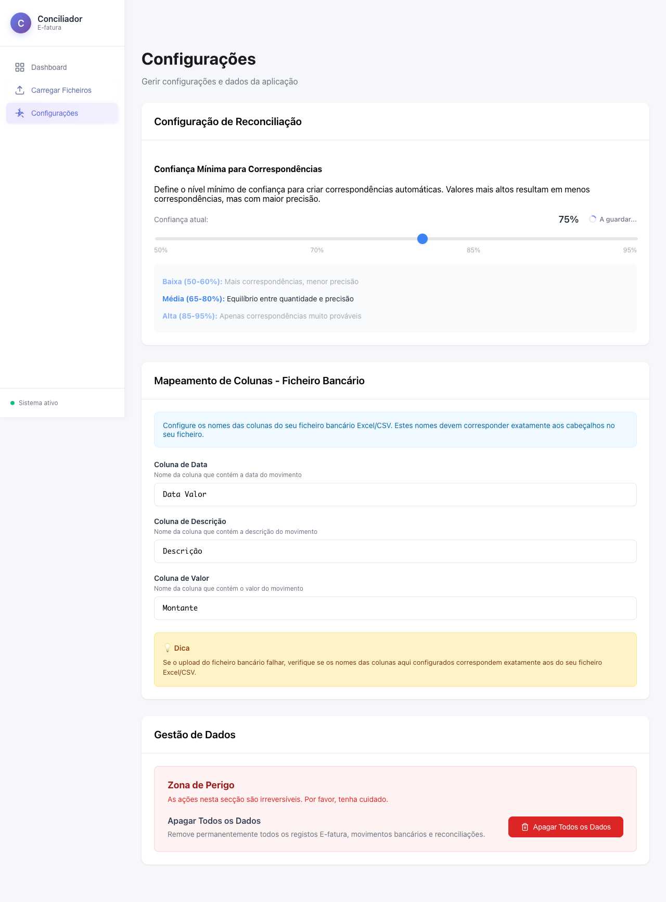

# Conciliador E-fatura POC

A web application for reconciling e-fatura records with bank movements, featuring intelligent matching algorithms and an intuitive user interface.

## Features

- Upload CSV/Excel files containing e-fatura records
- Upload Excel files containing bank movements
- Automatic matching based on:
  - Date (with configurable tolerance up to 30 days)
  - Amount (exact match with 0.01€ tolerance)
  - Description (fuzzy string matching with 80% threshold)
- Manual confirmation/rejection of matches
- Visual match confidence indicators
- Configurable bank column mappings
- Test data generation for demo purposes
- Document type visualization (Fatura, Nota de crédito, etc.)

## Screenshots

### Dashboard
The main dashboard shows reconciliation statistics and matched records:


### File Upload
Upload E-fatura CSV files and bank movement Excel files:


### Settings
Configure matching threshold and bank column mappings:


## Tech Stack

- **Frontend**: React with TypeScript
- **Backend**: FastAPI (Python)
- **Database**: SQLite
- **File Processing**: pandas, openpyxl, xlsxwriter
- **Matching Algorithm**: thefuzz (fuzzy string matching)

## Project Structure

```
conciliador-efatura-poc/
├── frontend/          # React TypeScript application
├── backend/           # FastAPI Python backend
├── screenshots/       # Application screenshots
└── README.md          # This file
```

## Getting Started

### Prerequisites

- Node.js 16+
- Python 3.8+

### Quick Start

1. Clone the repository:
   ```bash
   git clone https://github.com/pbastos/conciliador-efatura-poc.git
   cd conciliador-efatura-poc
   ```

2. Start the backend:
   ```bash
   cd backend
   python -m venv venv
   source venv/bin/activate  # On Windows: venv\Scripts\activate
   pip install -r requirements.txt
   uvicorn main:app --reload --port 8000
   ```

3. Start the frontend (in a new terminal):
   ```bash
   cd frontend
   npm install
   npm start
   ```

4. Open http://localhost:3002 in your browser

### First Use

1. Navigate to **Configurações** (Settings) to configure bank column mappings
2. Use **Carregar Ficheiros** to upload files or generate test data
3. View results in the **Dashboard**

## API Documentation

When the backend is running, visit:
- http://localhost:8000/docs - Interactive API documentation

## Key Features Explained

### Matching Algorithm
The application uses an intelligent matching algorithm that:
- Compares E-fatura records with bank movements
- Uses fuzzy string matching to handle variations in company names
- Considers date proximity (up to 30 days)
- Requires exact amount matching (with 0.01€ tolerance)
- Calculates confidence scores for each match
- Avoids ambiguous matches (skips when multiple candidates exist)

### Test Data Generation
Generate realistic test data directly from the UI:
- 300 E-fatura records
- 250 bank movements
- ~200 guaranteed matches for demonstration

### Column Mapping
Configure which columns in your bank Excel files contain:
- Date (Data Lançamento)
- Description (Descrição)
- Amount (Montante)

## License

This is a proof of concept project.